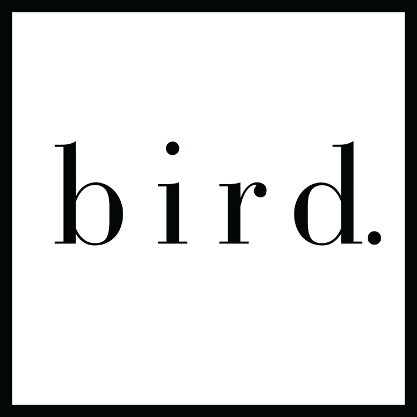

# bird-me
hair that soars above
<!DOCTYPE html>
<html>

<head>
    <meta charset="UTF-8">
    <!-- generator meta tag -->
    <!-- leave this for stats and Silex version check -->
    <meta name="generator" content="Silex v2.2.7">
    <!-- End of generator meta tag -->
       <link data-silex-static="" href="css/normalize.css" rel="stylesheet">
    <link data-silex-static="" href="css/front-end.css" rel="stylesheet">
     <link data-silex-static="" href="css/bootstrap-grid.css" rel="stylesheet">
     <link data-silex-static="" href="css/bootstrap-grid.css.map" rel="stylesheet">
     <link data-silex-static="" href="css/bootstrap-grid.min.css" rel="stylesheet">
     <link data-silex-static="" href="css/bootstrap-reboot.css" rel="stylesheet">
     <link data-silex-static="" href="css/bootstrap.css" rel="stylesheet">
     <link data-silex-static="" href="css/bootstrap.css.map" rel="stylesheet">
     <link data-silex-static="" href="css/bootstrap.min.css" rel="stylesheet">
     <link data-silex-static="" href="css/bootstrap-reboot.min.css.map" rel="stylesheet">
     <link data-silex-static="" href="css/bootstrap.min.css.map" rel="stylesheet">
     <link data-silex-static="" href="css/content.css" rel="stylesheet">
    
    
    
    
    
     
     
     
     
     
     
     
   
    
  

    <title></title>
    <meta name="viewport" content="width=device-width, initial-scale=1, maximum-scale=2.2" data-silex-viewport="">
    <meta name="publicationPath" content="/api/1.0/github/exec/put/galaxee/wip">

</head>

<body >
     
    

                

                    

                        

                   
                        

                    

                

        
&nbsp;

        

            

            &nbsp;
           
        

        

        
&nbsp;

    

    

        

            

                

                    <ul> 
                    <li><a href="#home" class="navatags">Home</a></li>&nbsp;
                        <li><a href="#Why" class="navatags">Why</a></li>
                        <li><a href="#contact" class="navatags">Contact</a></li>
<!--
                        <li><a href="#testimonials">Testimonials</a></li>
                        <li><a href="#services">Services</a></li>
                        <li><a href="#team">Team</a></li>
                        <li><a href="#pricing">Pricing</a></li>
                        <li><a href="#contact">Contact</a></li>
-->
                    </ul>
                

            

        

    

    
<section >
     
    
&nbsp;

    

    

       
        

                    <h1  class="heading1">Why</h1>
        

    

        

            

                        
We as a company believe in great hair and authentic beauty.

                
We get there because our creativity and passion for what we do create an interstellar connection between beauty and lifestyle each one of these feeds the other.

                
We inspire people through the way we make them feel about themselves. Aesthetically, mentally, and physically.

                
We create a world where anything is possible.

                   
<b>Integrity equals beauty</b>

                    

                

<!--
    

     
  
         

        
About More

      

         

    

-->
    

     
&nbsp;

</section>

<!--
      <section>
           
          

          

   

                    <h1 class="heading1">Experience</h1>
                        
Id strip steak officia swine, irure quis ea pig. Voluptate doner excepteur leberkas laboris. Irure eu turkey non duis biltong meatloaf ullamco laborum aliqua porchetta ad. Pig kevin rump cupidatat strip steak irue hamburger eiusmod
                            ut. Pancetta eu jowl drumstick pork chop capicola. Lorem in deserunt, kevin hamburger in spare ribs.

                         
               
   
            

               

            

                    <h1 class="heading1">Web Design</h1>
                    <h2 class="heading2">2014-2015</h2>
                    <h3 class="heading3">Web Solution "Solution Name"</h3>
                        
Id strip steak officia swine, irure quis ea pig. Voluptate doner excepteur leberkas laboris. Irure eu turkey non duis biltong meatloaf ullamco laborum aliqua porchetta ad.&nbsp;

                    

            
          

                    <h1 class="heading1">Mobile Apps Developer</h1>
                    <h2 class="heading2">2013-2014</h2>
                    <h3 class="heading3">Web Solution "Solution Name"</h3>
                    
                        
Id strip steak officia swine, irure quis ea pig. Voluptate doner excepteur leberkas laboris. Irure eu turkey non duis biltong meatloaf ullamco laborum aliqua porchetta ad.&nbsp;

                
  
            

               

           

                    <h1 class="heading1">WordPress Developer</h1>
                    <h2 class="heading2">2012-2013</h2>
                    <h3 class="heading3">Web Solution "Solution Name"</h3>
                        
Id strip steak officia swine, irure quis ea pig. Voluptate doner excepteur leberkas laboris. Irure eu turkey non duis biltong meatloaf ullamco laborum aliqua porchetta ad.&nbsp;

            

           

                    <h1 class="heading1">Web Design</h1>
                    <h2 class="heading2">2014-2015</h2>
                    <h3 class="heading3">Web Solution "Solution Name"</h3>
                        
Id strip steak officia swine, irure quis ea pig. Voluptate doner excepteur leberkas laboris. Irure eu turkey non duis biltong meatloaf ullamco laborum aliqua porchetta ad.&nbsp;

            

              

               

            

                    <h1 class="heading1">Mobile Apps Developer</h1>
                    <h2 class="heading2">2013-2014</h2>
                    <h3 class="heading3">Web Solution "Solution Name"</h3>
                        
Id strip steak officia swine, irure quis ea pig. Voluptate doner excepteur leberkas laboris. Irure eu turkey non duis biltong meatloaf ullamco laborum aliqua porchetta ad.&nbsp;

            

    

                    <h1 class="heading1">WordPress Developer</h1>
                    <h2 class="heading2">2012-2013</h2>
                    <h3 class="heading3">Web Solution "Solution Name"</h3>
                        
Id strip steak officia swine, irure quis ea pig. Voluptate doner excepteur leberkas laboris. Irure eu turkey non duis biltong meatloaf ullamco laborum aliqua porchetta ad.&nbsp;

              
 
            

          

 
&nbsp;

</section> 
-->

 
<!--
<section>
    

    

                    <h1 class="heading1">Pricing table</h1>
                        
Id strip steak officia swine, irure quis ea pig. Voluptate doner excepteur leberkas laboris. Irure eu turkey non duis biltong meatloaf ullamco laborum aliqua porchetta ad. Pig kevin rump cupidatat strip steak irure hamburger eiusmod
                            ut. Pancetta eu jowl drumstick pork chop capicola. Lorem in deserunt, kevin hamburger in spare ribs.

                         

    

    

    
&nbsp;

    </section>
-->
    <section class="black-background">
         
        
&nbsp;

        

    

        

        <h1>Contact Us!</h1>
        
<a href="mailto:bird.me@icloud.com">bird.me@icloud.com</a>

        
1320 Post Road

        
East Westport CT, 06880

        
<iframe src="https://www.google.com/maps/embed?pb=!1m18!1m12!1m3!1d1502.4069681358005!2d-73.31932614770561!3d41.13858759553013!2m3!1f0!2f0!3f0!3m2!1i1024!2i768!4f13.1!3m3!1m2!1s0x89e81afc9ca1e247%3A0x98fcf028f4152ce1!2s1320+Post+Rd+E%2C+Westport%2C+CT+06880!5e0!3m2!1sen!2sus!4v1528164914221" class="img-responsive" width="500" height="450" frameborder="0" style="border:0" allowfullscreen></iframe>

        

        

        
&nbsp;

    </section>
    
</body>

</html>
© 2018 GitHub, In
